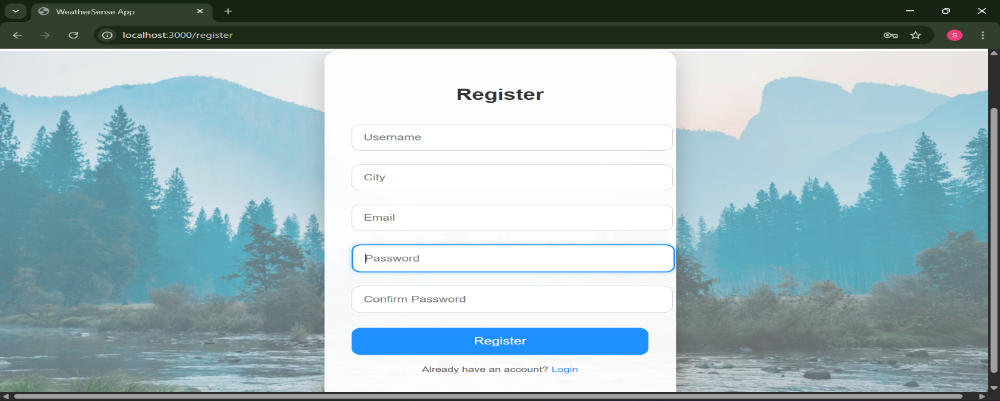
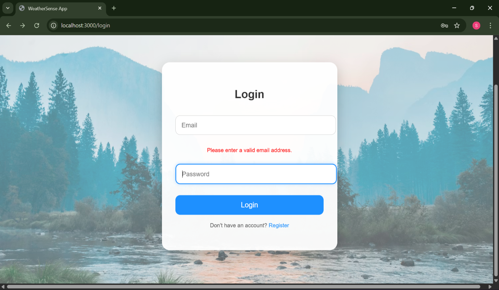
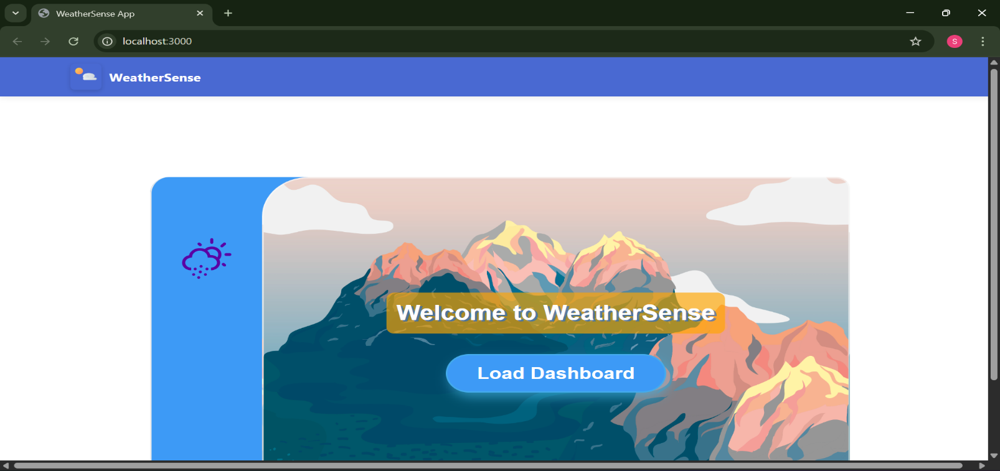
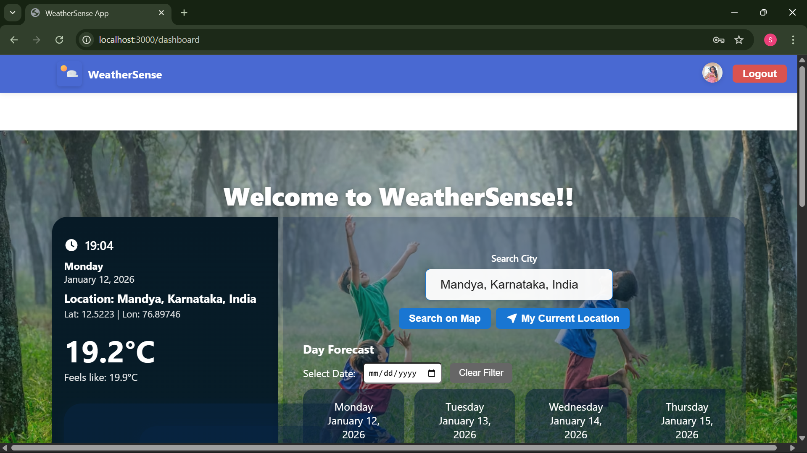
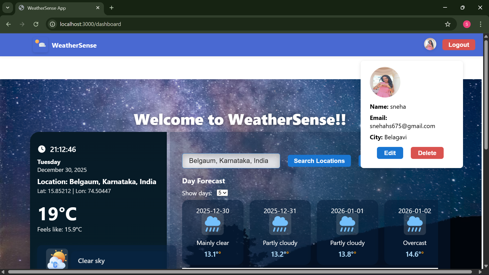
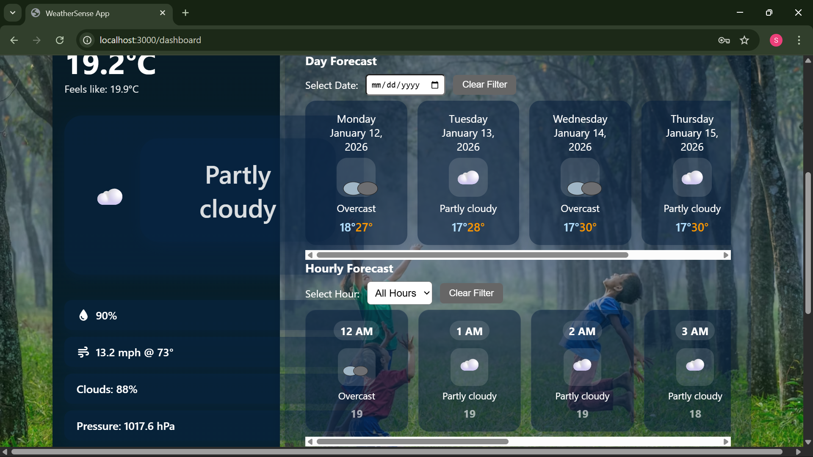
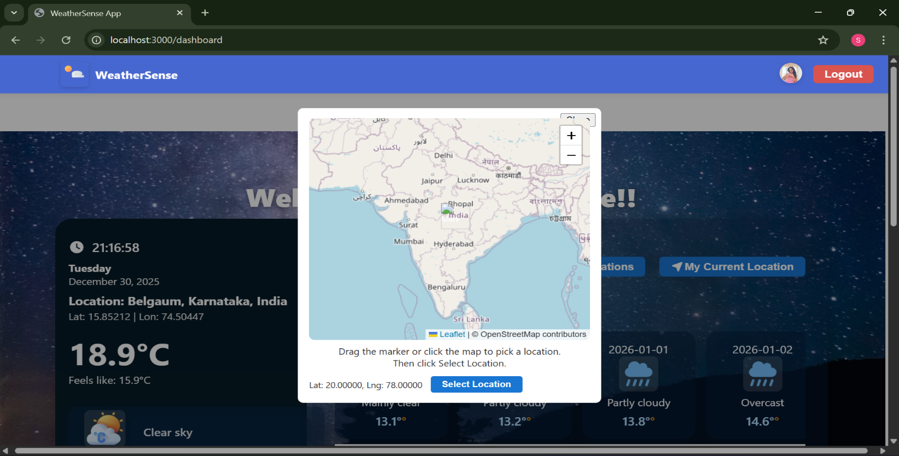

# 🌦️ WeatherSense

## 📌 Description
WeatherSense is a weather app that shows real-time temperature, humidity, and weather conditions and weather alerts.

## 🚀 Features
- Real-time weather updates
- Location-based data
- Easy to use UI
- weather alerts are given

## 🛠️ Technologies
- HTML, CSS, JavaScript
- MERN stack , Mongo DB
- Open meteo weather API

## 📸 Screenshots

